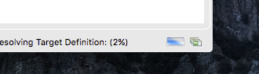

# Step 1 -Preparing the Development Environment

To develop GEF applications, we need:

* Java 8 JDK
* an instance of the Eclipse IDE
* the plug-in e(fx)clipse, which provides JavaFX support 
* a target platform to develop against.

The following sections will guiding you through the installations process. I presume you already have the Java Development Kit 8 on your system. If not please install it before continuing with the tutorial. 


## Installing Eclipse
First download the newest eclipse version. Either use the Eclipse-Installer or download the package: "Eclipse for RCP and RAP Development".
Click on [Eclipe RCP Package Downloadsite](http://www.eclipse.org/downloads/packages/eclipse-rcp-and-rap-developers/neonr) and clock on a download link on the right side fitting to your operating system.

We are using the RCP-Package, because of its support of OSGi-Manifests. Every project we will create will be a OSGi plug-in.


## Installing E(fx)clipse 

After installing eclipse, start it. No we need to install the plug-in e(fx)clipse. Do this by going to the *Help -> Install New  Software*.
Copy the URL `http://download.eclipse.org/efxclipse/updates-released/2.4.0/site/` into the selection box labeled *Work With*.
Choose *e(fx)clipse - install* and press *Finish*. After the plug-in is downloaded and installed, eclipse needs to restart.

Now we almost ready.

## Creating the target platform

The target platform specifies the environment for projects in an eclipse workspace. Only libraries or plug-ins in a target platform are possible dependencies of an OSGi-Project.
You can specify your target platform in the settings, but a cleaner way would be, to create a file, defining the target platform. This file is called target definition.

We will use the integration build of GEF. The README in the Github repository of GEF (`https://www.github.com/eclipse/gef`) provides the target definition. We will create an empty project which contains the definition file.

Do the following steps:

1. Create a new project, called: `com.itemis.gef.tutorial.mindmap.target`.  
2. Create a new file, and call it `gef.target` and close the target editor.
3. Open the target definition file with a text editor, by choosing  *Open With->Text Editor* in the files context menu. 
4. Copy the following text into the file, save and close the editor.
```xml
<?xml version="1.0" encoding="UTF-8" standalone="no"?>
<?pde version="3.8"?>
<target name="gef-integration" sequenceNumber="1">
<locations>
  <location includeAllPlatforms="false" includeConfigurePhase="true" includeMode="planner" includeSource="true" type="InstallableUnit">
    <unit id="org.eclipse.xtext.sdk.feature.group" version="2.10.0.v201605250459"/>
    <unit id="org.eclipse.emf.sdk.feature.group" version="2.12.0.v20160526-0356"/>
    <unit id="org.eclipse.sdk.ide" version="4.6.0.I20160606-1100"/>
    <repository location="http://download.eclipse.org/releases/neon"/>
  </location>
  <location includeAllPlatforms="false" includeConfigurePhase="true" includeMode="planner" includeSource="true" type="InstallableUnit">
    <unit id="org.eclipse.gef.common.sdk.feature.group" version="0.0.0"/>
    <unit id="org.eclipse.gef.geometry.sdk.feature.group" version="0.0.0"/>
    <unit id="org.eclipse.gef.fx.sdk.feature.group" version="0.0.0"/>
    <unit id="org.eclipse.gef.mvc.sdk.feature.group" version="0.0.0"/>
    <unit id="org.eclipse.gef.mvc.examples.source.feature.group" version="0.0.0"/>
    <unit id="org.eclipse.gef.layout.sdk.feature.group" version="0.0.0"/>
    <unit id="org.eclipse.gef.graph.sdk.feature.group" version="0.0.0"/>
    <unit id="org.eclipse.gef.zest.sdk.feature.group" version="0.0.0"/>
    <unit id="org.eclipse.gef.zest.examples.source.feature.group" version="0.0.0"/>
    <unit id="org.eclipse.gef.dot.sdk.feature.group" version="0.0.0"/>
    <unit id="org.eclipse.gef.cloudio.sdk.feature.group" version="0.0.0"/>
    <repository location="http://download.eclipse.org/tools/gef/updates/integration"/>
  </location>
</locations>
</target>
```
5. Now open the target definition with the target editor (*Open With->Target Editor* in the context menu)
6. It will take some time to resolve the target definition. Please be patient, it takes a wile. To see the progress you can press the button in the lower right corner. this will open the progress view.

7. After the target definition is resolved, click *Set as Target Platform* in the upper right corner of the editor. The target definition is set, and we can test the environment.

## Test the Environment

To test our environment, we will import some GEF examples form the Github repository.

1. Go to *File -> Import...*, the select *Git/Projects from Git* and press *Next*
2. Select *Clone URI* and press *Next*
3. Paste the URL: `https://github.com/eclipse/gef.git` to the URI field and press *Next*
4. Select *master* branch and press *Next*
5. Confirm you local directory or change the path and press *Next*
6. Ensure that *Import existing Eclipse projects* is checked, then select *Working Tree* and press *Next*
7. No select `org.eclipse.gef.fx.examples` and press *Finish* (you can import all the example projects, but for our environment test only this one is needed.
8. In the project Explorer go to `/org.eclipse.gef.fx.examples/src/org/eclipse/gef/fx/examples/ConnectionSnippet.java` and choose *Run As->Java Application*. A window should open.

On MacOS you don't see a window. Go to the Console View and press the red square to terminate the application. Then go to *Run->Run Configurations...*. In the appearing dialog, you'll need to select the 
configuration for the Snippet. It should be at *Java Application->ConnectionSnippet* in the tree. Then go to the tab labeled *Arguments* and uncheck the box *-XstartOnFirstThread argument when launching with SWT*. 

**This is necessary for every JavaFX application**.

Now we are set up to develop our own GEF mind map editor.


