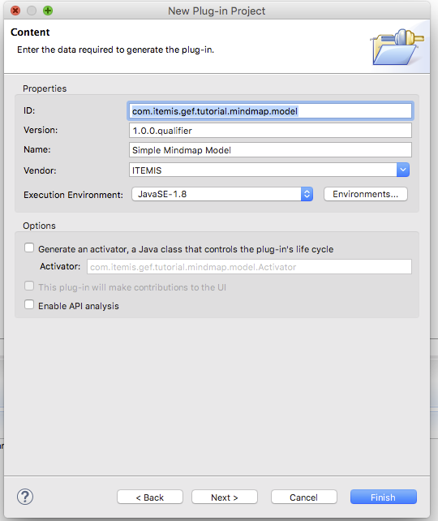

# Step 2 - Creating the model

GEF is implementing the MVC pattern, so what we need first is our Model.

Our simple mind map only consists of two elements: a `MindMapNode` and a `MindMapConnection`. Both are collected in a `SimpleMindmap`. To collect all elements of the mind map,
we create an abstract class `AbstractMindMapItem` which will be the super class of nodes and connections.

## Create the project

To create the model, we first we need a project.

Create a new Plugin-project called `com.itemis.gef.tutorial.mindmap.model`. Set the *content* as in the screenshot below.

After the creation of the project, open the file `MANIFEST.MF` in the folder, go to the tab *Dependencies* and add the following package into the *imported Packages* list:
 * com.google.common.collect
 * org.eclipse.gef.geometry.planar

Without this setting, eclipse can't find the classes in this packages we want to use in our model.

##Create the abstract class

Every element in our mind map is a subclass of `AbstractMindMapItem`. 

	package com.itemis.gef.tutorial.mindmap.model;
	
	import java.beans.PropertyChangeListener;
	import java.beans.PropertyChangeSupport;
	import java.io.Serializable;
	
	public class AbstractMindMapItem implements Serializable {
		/**
		 * Generated UUID
		 */
		private static final long serialVersionUID = -2558628513984118991L;
		
		protected PropertyChangeSupport pcs = new PropertyChangeSupport(this);
	
		public void addPropertyChangeListener(PropertyChangeListener listener) {
			pcs.addPropertyChangeListener(listener);
		}
	
		public void removePropertyChangeListener(PropertyChangeListener listener) {
			pcs.removePropertyChangeListener(listener);
		}
	}

The `PropertyChangeSupport` is used to listen to model changes.
 
 
## Create the SimpleMindMap

The `SimpleMindMap` is the parent of our 

Let's create the class *SimpleMindMap* in the package `com.itemis.gef.turorial.model`. Here is the code:

	package com.itemis.gef.tutorial.mindmap.model;
	
	import java.util.List;
	
	import com.google.common.collect.Lists;
	
	public class SimpleMindMap extends AbstractMindMapItem {
		/**
		 * Generated UUID
		 */
		private static final long serialVersionUID = 4667064215236604843L;
	
		public static final String PROP_CHILD_ELEMENTS = "childElements";
		
		private List<AbstractMindMapItem> childElements = Lists.newArrayList();
		
		public List<AbstractMindMapItem> getChildElements() {
			return childElements;
		}
		
		public void addChildElement(AbstractMindMapItem node) {
			childElements.add(node);
			pcs.firePropertyChange(PROP_CHILD_ELEMENTS, null, node);
		}
		
		public void addChildElement(AbstractMindMapItem node, int idx) {
			childElements.add(idx, node);
			pcs.firePropertyChange(PROP_CHILD_ELEMENTS, null, node);
		}
	
		public void removeChildElement(AbstractMindMapItem node) {
			childElements.remove(node);
			pcs.firePropertyChange(PROP_CHILD_ELEMENTS, node, null);
		}
	
	}
	
The code is self explanatory. The simple mind map just consist of a list of MindMapItems. Although we could add a `SimpleMindMap`as child, we will not support that right now.

You might wonder, why the node and the connections are'nt in separate lists. We will come to that in a later tutorial. 

# Create the MindMapNode

First we need to create an empty class: `MindMapConnection` so we can use it in our references. After thatcreate the class `MindMapNode`.

Here is the code:
  
	package com.itemis.gef.tutorial.mindmap.model;
	
	import java.io.Serializable;
	import java.util.List;
	
	import org.eclipse.gef.geometry.planar.Rectangle;
	
	import com.google.common.collect.Lists;
	
	import javafx.scene.paint.Color;
	
	public class MindMapNode extends AbstractMindMapItem implements Serializable {
		/**
		 * Generated UUID
		 */
		private static final long serialVersionUID = 8875579454539897410L;
		
		public static final String PROP_TITLE = "title";
		public static final String PROP_DESCRIPTION = "description";
		public static final String PROP_COLOR = "color";
		public static final String PROP_BOUNDS = "bounds";
		
		public static final String PROP_INCOMING_CONNECTIONS = "incomingConnections";
		public static final String PROP_OUTGOGING_CONNECTIONS = "outgoingConnections";
	
		/**
		 * The title of the node
		 */
		private String title;
	
		/**
		 * he description of the node, which is optional
		 */
		private String description;
	
		/**
		 * The background color of the node
		 */
		private Color color;
		
		/**
		 * The size and position of the visual representation
		 */
		private Rectangle bounds;
	
		private List<MindMapConnection> incomingConnections = Lists.newArrayList();
		private List<MindMapConnection> outgoingConnections = Lists.newArrayList();
	
		public String getTite() {
			return title;
		}
	
		public void setTite(String title) {
			pcs.firePropertyChange(PROP_TITLE, this.title, (this.title = title));
		}
	
		public String getDescription() {
			return description;
		}
	
		public void setDescription(String description) {
			pcs.firePropertyChange(PROP_DESCRIPTION, this.description, (this.description = description));
		}
	
		public Color getColor() {
			return color;
		}
	
		public void setColor(Color color) {
			pcs.firePropertyChange(PROP_COLOR, this.color, (this.color = color));
		}
		
		public Rectangle getBounds() {
			return bounds;
		}
		
		public void setBounds(Rectangle bounds) {
			pcs.firePropertyChange(PROP_BOUNDS, this.bounds, (this.bounds = bounds.getCopy()));
		}
		
		public List<MindMapConnection> getOutgoingConnections() {
			return outgoingConnections;
		}
	
		public void addOutgoingConnection(MindMapConnection conn) {
			outgoingConnections.add(conn);
			pcs.firePropertyChange(PROP_OUTGOGING_CONNECTIONS, null, conn);
		}
	
		public void removeOutgoingConnection(MindMapConnection conn) {
			outgoingConnections.remove(conn);
			pcs.firePropertyChange(PROP_OUTGOGING_CONNECTIONS, conn, null);
		}
		
		public List<MindMapConnection> getIncomingConnections() {
			return incomingConnections;
		}
	
		public void addIncomingConnection(MindMapConnection conn) {
			incomingConnections.add(conn);
			pcs.firePropertyChange(PROP_INCOMING_CONNECTIONS, null, conn);
		}
	
		public void removeIncomingConnection(MindMapConnection conn) {
			incomingConnections.remove(conn);
			pcs.firePropertyChange(PROP_INCOMING_CONNECTIONS, conn, null);
		}
	
	}

This class is also quite easy to understand. A `MindMapNode` has a title and description property. These are the two semantic properties for our mindmap.
The other two properties are storing visual information. The first is the color (which is teh background color of our node) and the second is the bounding box,
which defines the size and the position of the node in the mind map.

In addition we store references of connections, which either are incoming or outgoing connections. These references are used to find the connection to delete, when we are removing a node.

We also inform any listener on changes of the model, via the `PropertyChangeSupport`.

# Create the MindMapConnection

The last model class we create is the `MindMapConnection`.

	package com.itemis.gef.tutorial.mindmap.model;
	
	public class MindMapConnection extends AbstractMindMapItem {
	
		/**
		 * Generated UUID
		 */
		private static final long serialVersionUID = 6065237357753406466L;
	
		private MindMapNode source;
		private MindMapNode target;
		private boolean connected;
	
		public MindMapNode getSource() {
			return source;
		}
	
		public void setSource(MindMapNode source) {
			this.source = source;
		}
	
		public MindMapNode getTarget() {
			return target;
		}
	
		public void setTarget(MindMapNode target) {
			this.target = target;
		}
	
		public void connect(MindMapNode source, MindMapNode target) {
			if (source == null || target == null || source == target) {
				throw new IllegalArgumentException();
			}
			disconnect();
			this.source = source;
			this.target = target;
			reconnect();
		}
	
		public void disconnect() {
			if (connected) {
				source.removeOutgoingConnection(this);
				target.removeIncomingConnection(this);
				connected = false;
			}
		}
	
		public void reconnect() {
			if (!connected) {
				source.addOutgoingConnection(this);
				target.addIncomingConnection(this);
				connected = true;
			}
		}
	}
	
The Connection just has it's source and it's target node and two helper methods to connect to nodes.

## Creating a factory

To test our application, we want to use some test model. This model will be created by the `SimpleMindMapExampleFactory`.

Here is the code:

	package com.itemis.gef.tutorial.mindmap.model;
	
	import org.eclipse.gef.geometry.planar.Rectangle;
	
	import javafx.scene.paint.Color;
	
	public class SimpleMindMapExampleFactory {
		
		public SimpleMindMap createSingleNodeExample() {
			SimpleMindMap mindMap = new SimpleMindMap();
			
			MindMapNode center = new MindMapNode();
			center.setTite("The Core Idea");
			center.setDescription("This is my Core idea. I need a larger Explanation to it, so I can test the warpping.");
			center.setColor(Color.GREENYELLOW);
			center.setBounds(new Rectangle(20,  50, 100, 100));
			
			mindMap.addChildElement(center);
			
			return mindMap;
		}
		
		public SimpleMindMap createComplexExample() {
			SimpleMindMap mindMap = new SimpleMindMap();
			
			MindMapNode center = new MindMapNode();
			center.setTite("The Core Idea");
			center.setDescription("This is my Core idea");
			center.setColor(Color.GREENYELLOW);
			center.setBounds(new Rectangle(250,  50, 100, 100));
			
			mindMap.addChildElement(center);
			
			MindMapNode child = null;
			for (int i=0; i<5; i++) {
				child = new MindMapNode();
				child.setTite("Association #"+i);
				child.setDescription("I just realized, this is related to the core idea!");
				child.setColor(Color.ALICEBLUE);
				
				child.setBounds(new Rectangle(50+(i*200),  250, 100, 100));
				mindMap.addChildElement(child);
				
				MindMapConnection conn = new MindMapConnection();
				conn.connect(center, child);
				mindMap.addChildElement(conn);
			}
			
			MindMapNode child2 = new MindMapNode();
			child2.setTite("Association #4-2");
			child2.setDescription("I just realized, this is related to the last idea!");
			child2.setColor(Color.LIGHTGRAY);
			child2.setBounds(new Rectangle(250,  550, 100, 100));
			mindMap.addChildElement(child2);
			
			MindMapConnection conn = new MindMapConnection();
			conn.connect(child, child2);
			mindMap.addChildElement(conn);
			
			return mindMap;
			
		}
	}

The first method create a mind map with just one node. The other create a moe complex map.

## Exporting our model

Finally we need to edit the `MANIFEST.MF` file again. Go to the tab *Runtime* and press *Add* next to left list. Choose the package `com.itemis.gef.tutorial.mindmap.model` and save the file.
Now other projects can use our model. 

the final `MANIFEST.MF` should look like this:

	Manifest-Version: 1.0
	Bundle-ManifestVersion: 2
	Bundle-Name: Simple Mindmap Model
	Bundle-SymbolicName: com.itemis.gef.tutorial.mindmap.model
	Bundle-Version: 1.0.0.qualifier
	Bundle-Vendor: ITEMIS
	Bundle-RequiredExecutionEnvironment: JavaSE-1.8
	Import-Package: com.google.common.collect,
	 org.eclipse.gef.geometry.planar
	Export-Package: com.itemis.gef.tutorial.mindmap.model

