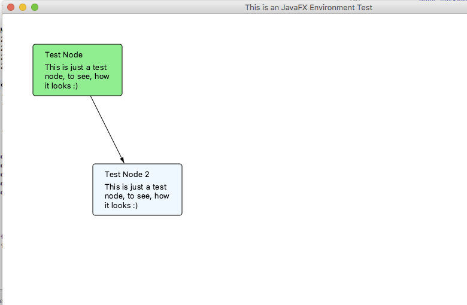

# Step 3 - Defining the Visuals

## What are Visuals?

Visuals are graphical representations of our model. They represent the view in the MCV-pattern.

## Create and Configure the project
We create a new Plug-in project called `com.itemis.gef.tutorial.visuals`.
After the creation, open the `MANIFEST.MF` and go to the *dependencies* tab.

Again, we import the package: `com.google.common.collect`

In addition, we have some plugin dependencies. Add the following plugins to the list *Required Plug-ins*:

 * org.eclipse.gef.geometry
 * org.eclipse.gef.fx
 * org.eclipse.gef.common
 * org.eclipse.gef.geometry.convert.fx

Set the minimum version to 5.0.0.

## Create the connection visual

The first visual is the Connection visual. The class `MindMapConnectionVisuals` inherits from the class
`org.eclipse.gef.fx.nodes.Connection`and specifies an arrow head in the constructor.

Here is the code:

	package com.itemis.gef.tutorial.mindmap.visuals;
	
	import org.eclipse.gef.fx.nodes.Connection;
	
	import javafx.scene.paint.Color;
	import javafx.scene.shape.Polygon;
	
	public class MindMapConnectionVisuals extends Connection {
	
		public static class ArrowHead extends Polygon {
			public ArrowHead() {
				super(0, 0, 10, 3, 10, -3);
			}
		}
	
		public MindMapConnectionVisuals() {
			ArrowHead endDecoration = new ArrowHead();
			endDecoration.setFill(Color.BLACK);
			setEndDecoration(endDecoration);
		}
		
	}

## Create the node visual

The second visual is a bit more complex. basically our node is a rectangle with rounded corners and two text elements inside.

With some JavaFX knowledge, you should understand the following code:

 
	package com.itemis.gef.tutorial.mindmap.visuals;
	
	import org.eclipse.gef.fx.nodes.GeometryNode;
	import org.eclipse.gef.geometry.planar.RoundedRectangle;
	
	import javafx.beans.value.ChangeListener;
	import javafx.beans.value.ObservableValue;
	import javafx.geometry.Insets;
	import javafx.geometry.VPos;
	import javafx.scene.Group;
	import javafx.scene.Node;
	import javafx.scene.layout.StackPane;
	import javafx.scene.layout.VBox;
	import javafx.scene.paint.Color;
	import javafx.scene.text.Text;
	import javafx.scene.text.TextFlow;
	
	public class MindMapNodeVisual extends Group {
		private Text titleText;
		private TextFlow descriptionFlow;
		private Text descriptionText;
	
		private GeometryNode<RoundedRectangle> shape;
	
		private VBox labelGroup;
	
		private StackPane stackPane;
		
		public MindMapNodeVisual() {
			shape = new GeometryNode<>(new RoundedRectangle(0, 0, 70, 30, 8, 8));
			shape.setFill(Color.LIGHTGREEN);
			shape.setStroke(Color.BLACK);
	
			labelGroup = new VBox(5);
			labelGroup.setPadding(new Insets(10, 20, 10, 20));
	
			// create label
			titleText = new Text();
			titleText.setTextOrigin(VPos.TOP);
	
			descriptionText = new Text();
			descriptionText.setTextOrigin(VPos.TOP);
	
			
			descriptionFlow = new TextFlow(descriptionText);
			descriptionFlow.setMaxWidth(150);
			labelGroup.getChildren().addAll(titleText, descriptionFlow);
	
			stackPane = new StackPane();
			stackPane.setPrefWidth(150);
			stackPane.getChildren().addAll(shape, labelGroup);
			
			getChildren().addAll(stackPane);
			
			shape.widthProperty().addListener(new ChangeListener<Number>() {
	
				@Override
				public void changed(ObservableValue<? extends Number> observable, Number oldValue, Number newValue) {
					double val = (double) newValue;
					stackPane.setPrefWidth(val);
					descriptionFlow.setMaxWidth(val);
				}
			});
		}
	
		public Node getShape() {
			return shape;
		}
		
		public void resizeShape(double width, double height) {
			descriptionText.setWrappingWidth(width-30);
			shape.resize(width, height);
		}
	
		public void setColor(Color color) {
			shape.setFill(color);
		}
	
		public void setTitle(String title) {
			this.titleText.setText(title);
		}
	
		public void setDescription(String description) {
			this.descriptionText.setText(description);
		}
	
		public Text getTitleText() {
			return titleText;
		}
	
		public Text getDescriptionText() {
			return descriptionText;
		}
	}

	
The `descriptionText` is embedded in a textflow, so it will warp correctly, when the node is resized.

## How does it look?

To test our visuals, we create a little JavaFX Application and create some examples.

Here is the code:

	package com.itemis.gef.tutorial.mindmap.visuals;
	
	import org.eclipse.gef.fx.anchors.ChopBoxStrategy;
	import org.eclipse.gef.fx.anchors.DynamicAnchor;
	import org.eclipse.gef.fx.nodes.Connection;
	
	import com.itemis.gef4.tutorial.mindmap.visuals.ConnectionVisual;
	import com.itemis.gef4.tutorial.mindmap.visuals.MindMapNodeVisual;
	
	import javafx.application.Application;
	import javafx.scene.Scene;
	import javafx.scene.layout.Pane;
	import javafx.scene.paint.Color;
	import javafx.stage.Stage;
	
	public class MindMapVisualApplication extends Application {
	
		@Override
		public void start(Stage primaryStage) throws Exception {
			Pane root = new Pane();
	
			// create state visuals
			MindMapNodeVisual node = new MindMapNodeVisual();
			node.setTitle("Test Node");
			node.setDescription("This is just a test node, to see, how it looks :)");
			node.relocate(50, 50);
			
			MindMapNodeVisual node2 = new MindMapNodeVisual();
			node2.setTitle("Test Node 2");
			node2.setDescription("This is just a test node, to see, how it looks :)");
			node2.relocate(150, 250);
			node2.setColor(Color.ALICEBLUE);
			
			Connection conn = new MindMapConnectionVisuals();
			conn.setStartAnchor(new DynamicAnchor(node, new ChopBoxStrategy()));
			conn.setEndAnchor(new DynamicAnchor(node2, new ChopBoxStrategy()));
			
			
			root.getChildren().addAll(conn, node, node2);
		
			
			primaryStage.setResizable(true);
			primaryStage.setScene(new Scene(root, 1024, 768));
			primaryStage.setTitle("This is an JavaFX Environment Test");
			primaryStage.sizeToScene();
			primaryStage.show();
	
		}
	
		
		public static void main(String[] args) {
			Application.launch(args);
		}
		
	}

The class is a subclass of `javafx.application.Application` which manages the whole creation of a window and the event cycles.
When it is ready to render, the method `start`is called and we need to create a `Scene` for the given `Stage` (please refer to the JavaFX documentation for more details).

First we create two nodes, after that we connect them with a MindMapConnectionVisual. To do that, we need to create anchors, which are used to calculate the end of the connection. A `DynamicAnchor` calculates the ends based on the bounds of another node. We use a ChopBoxStrategiy, which means, the Anchor is at the bounding box of our node and is directed to the center of the node.

To start the application, just use the context menu on the java file and chose: *Run as->Java Application*. If you are on a Mac, kill the application in the console view, go to the *Run Configurations* end uncheck the box *-XstartOnFirstThread argument when launching with SWT* in the  *Arguments* tab.

The example should look like this:

## Exporting the package

Similar to the model, we need to export our visual package to be able to use it outside the plug-in.
Open the file `MANIFEST.MF` and go to the tab *Runtime*.
Press *Add* and add the package ``.

Your final file should be locking like this:

	Manifest-Version: 1.0
	Bundle-ManifestVersion: 2
	Bundle-Name: Visuals
	Bundle-SymbolicName: com.itemis.gef.tutorial.mindmap.visuals
	Bundle-Version: 1.0.0.qualifier
	Bundle-Vendor: ITEMIS
	Bundle-RequiredExecutionEnvironment: JavaSE-1.8
	Require-Bundle: org.eclipse.gef.geometry;bundle-version="5.0.0",
	 org.eclipse.gef.fx;bundle-version="5.0.0",
	 org.eclipse.gef.common;bundle-version="5.0.0",
	 org.eclipse.gef.geometry.convert.fx;bundle-version="5.0.0"
	Import-Package: com.google.common.collect;version="15.0.0"
	Export-Package: com.itemis.gef.tutorial.mindmap.visuals

