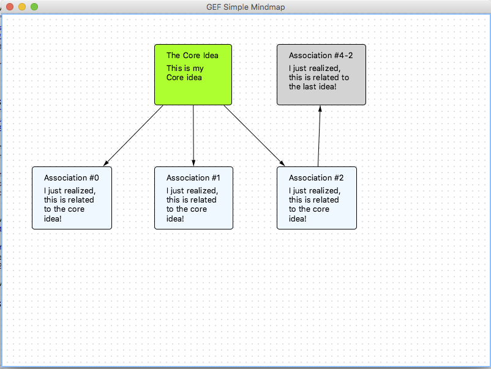

# Step 4 - Creating the GEF Parts

In this Tutorial, we will create a project, which uses the GEF-MVC framework. We will create a new project, create a new application and configure it vie a dependency injection.

The main part of this tutorial, we will create parts for our model. The parts are the controller in the MVC pattern. They are controlled by policies and behaviors which are injected via the framework.
Confused? Don't worry, in the end of the tutorial, you will understand.  

## Create a new project

Now we will create a new project called `com.itemis.gef.tutorial.mindmap`.
Go to the tab `Manifest.MF` and copy the following text into the file.

	Require-Bundle: org.eclipse.gef.common;bundle-version="5.0.0",
	 org.eclipse.gef.fx;bundle-version="5.0.0",
	 org.eclipse.gef.geometry;bundle-version="5.0.0",
	 org.eclipse.gef.mvc;bundle-version="5.0.0",
	 org.eclipse.gef.mvc.fx;bundle-version="5.0.0",
	 org.eclipse.core.commands;bundle-version="3.8.0",
	 org.eclipse.core.runtime;bundle-version="3.12.0",
	 com.itemis.gef.tutorial.mindmap.model;bundle-version="1.0.0",
	 com.itemis.gef.tutorial.mindmap.visuals;bundle-version="1.0.0"
	Import-Package: com.google.common.collect;version="15.0.0",
	 com.google.common.reflect;version="15.0.0",
	 com.google.inject;version="1.3.0",
	 com.google.inject.binder;version="1.3.0",
	 com.google.inject.multibindings;version="1.3.0",
	 javax.inject;version="1.0.0"

Alternatively, you can set the dependencies on the `Dependencies` tab manually.

## Creating the parts

For each of our models, we need apart. A part is used connects the visual with the model, and implements changes to them.

### SimpleMindMapPart

If you recall, we didn't create a visual for `SimpleMindMap`. We will use a JavaFX `Group` as container for our nodes.

See the following code:

	package com.itemis.gef.tutorial.mindmap.parts;

	import java.util.List;
	
	import org.eclipse.gef.mvc.fx.parts.AbstractFXContentPart;
	import org.eclipse.gef.mvc.parts.IVisualPart;
	
	import com.google.common.collect.HashMultimap;
	import com.google.common.collect.Lists;
	import com.google.common.collect.SetMultimap;
	import com.itemis.gef.tutorial.mindmap.model.AbstractMindMapItem;
	import com.itemis.gef.tutorial.mindmap.model.SimpleMindMap;
	
	import javafx.scene.Group;
	import javafx.scene.Node;
	
	public class SimpleMindMapPart extends AbstractFXContentPart<Group> {
	
		@Override
		public SimpleMindMap getContent() {
			return (SimpleMindMap) super.getContent();
		}
	
		@Override
		protected SetMultimap<? extends Object, String> doGetContentAnchorages() {
			return HashMultimap.create();
		}
	
		@Override
		protected List<? extends Object> doGetContentChildren() {
			return Lists.newArrayList(getContent().getChildElements());
		}
	
		@Override
		protected Group createVisual() {
			// the visual is just a container for our child visuals (nodes and
			// connections)
			return new Group();
		}
	
		@Override
		protected void addChildVisual(IVisualPart<Node, ? extends Node> child, int index) {
			getVisual().getChildren().add(child.getVisual());
		}
	
		@Override
		protected void removeChildVisual(IVisualPart<Node, ? extends Node> child, int index) {
			getVisual().getChildren().remove(child.getVisual());
		}
	
		@Override
		protected void doAddContentChild(Object contentChild, int index) {
			if (contentChild instanceof AbstractMindMapItem) {
				getContent().addChildElement((AbstractMindMapItem) contentChild, index);
			} else {
				throw new IllegalArgumentException("contentChild has invalid type: " + contentChild.getClass());
			}
		}
	
		@Override
		protected void doRemoveContentChild(Object contentChild) {
			if (contentChild instanceof AbstractMindMapItem) {
				getContent().removeChildElement((AbstractMindMapItem) contentChild);
			} else {
				throw new IllegalArgumentException("contentChild has invalid type: " + contentChild.getClass());
			}
		}
	
		@Override
		protected void doRefreshVisual(Group visual) {
			// no refreshing necessary, just a Group
		}
	}

	
This part uses a `javafx.scene.Group` node as visual representation, which is created in the method called `createVisual`. The rest of the methods is
used to manage changes in the model or view. The model is called the content of the part. If you wonder, where the content is set, we'll come to that later.

 
### MindMapNodePart

The `MindMapNodePart` represents one node in our map. It creates the `MindMapNodeVisual` and also refreshes the properties of the visual, if there are changes in the model.

Here is the code:

	package com.itemis.gef.tutorial.mindmap.parts;
	
	import java.util.Collections;
	import java.util.List;
	
	import org.eclipse.gef.geometry.planar.Rectangle;
	import org.eclipse.gef.mvc.fx.parts.AbstractFXContentPart;
	import org.eclipse.gef.mvc.fx.policies.FXTransformPolicy;
	
	import com.google.common.collect.HashMultimap;
	import com.google.common.collect.SetMultimap;
	import com.itemis.gef.tutorial.mindmap.model.MindMapNode;
	import com.itemis.gef.tutorial.mindmap.visuals.MindMapNodeVisual;
	
	import javafx.scene.transform.Affine;
	
	public class MindMapNodePart extends AbstractFXContentPart<MindMapNodeVisual>  {
	
		@Override
		public MindMapNode getContent() {
			return (MindMapNode) super.getContent();
		}
	
		@Override
		protected SetMultimap<? extends Object, String> doGetContentAnchorages() {
			return HashMultimap.create();
		}
	
		@Override
		protected List<? extends Object> doGetContentChildren() {
			return Collections.emptyList();
		}
	
		@Override
		protected MindMapNodeVisual createVisual() {
			return new MindMapNodeVisual();
		}
	
		@Override
		protected void doRefreshVisual(MindMapNodeVisual visual) {
	
			MindMapNode node = getContent();
			Rectangle rec = node.getBounds();
	
			visual.setTitle(node.getTite());
			visual.setDescription(node.getDescription());
			visual.setColor(node.getColor());
	
			visual.resizeShape(rec.getWidth(), rec.getHeight());
	
			Affine affine = getAdapter(FXTransformPolicy.TRANSFORM_PROVIDER_KEY).get();
			affine.setTx(rec.getX());
			affine.setTy(rec.getY());
	
		}
	}

	
### MindMapConnectionPart

The `MindMapConnectionpart` represents a connection. It creates a `MindMapConnectionVisual`  and configures the anchors. 

Here is the code:

	package com.itemis.gef.tutorial.mindmap.parts;
	
	import java.util.Collections;
	import java.util.List;
	
	import org.eclipse.gef.common.adapt.AdapterKey;
	import org.eclipse.gef.fx.anchors.IAnchor;
	import org.eclipse.gef.fx.nodes.Connection;
	import org.eclipse.gef.mvc.fx.parts.AbstractFXContentPart;
	import org.eclipse.gef.mvc.parts.IVisualPart;
	
	import com.google.common.collect.HashMultimap;
	import com.google.common.collect.SetMultimap;
	import com.google.common.reflect.TypeToken;
	import com.google.inject.Provider;
	import com.itemis.gef.tutorial.mindmap.model.MindMapConnection;
	import com.itemis.gef.tutorial.mindmap.visuals.MindMapConnectionVisuals;
	
	import javafx.scene.Node;
	
	public class MindMapConnectionPart extends AbstractFXContentPart<Connection> {
			
			private static final String START_ROLE = "START";
			private static final String END_ROLE = "END";
			
			@Override
			public MindMapConnection getContent() {
				return (MindMapConnection) super.getContent();
			}
			
			@Override
			protected SetMultimap<? extends Object, String> doGetContentAnchorages() {
				SetMultimap<Object, String> anchorages = HashMultimap.create();
	
				anchorages.put(getContent().getSource(), START_ROLE);
				anchorages.put(getContent().getTarget(), END_ROLE);
	
				return anchorages;
			}
	
			@Override
			protected List<? extends Object> doGetContentChildren() {
				return Collections.emptyList();
			}
	
			@Override
			protected Connection createVisual() {
				return new MindMapConnectionVisuals();
			}
	
			@Override
			protected void doRefreshVisual(Connection visual) {
				// nothing to do here
			}
			
			@Override
			protected void attachToAnchorageVisual(IVisualPart<Node, ? extends Node> anchorage, String role) {
				
				// find a anchor provider, which must be registered in the module
				// be aware to use the right interfaces (Proviser is used a lot)
				@SuppressWarnings("serial")
				Provider<? extends IAnchor> adapter = anchorage.getAdapter(AdapterKey.get(new TypeToken<Provider<? extends IAnchor>>() {}));
				if (adapter == null) {
					throw new IllegalStateException("No adapter  found for <" + anchorage.getClass() + "> found.");
				}
				IAnchor anchor = adapter.get();
				
				if (role.equals(START_ROLE)) {
					getVisual().setStartAnchor(anchor);
				} else if (role.equals(END_ROLE)) {
					getVisual().setEndAnchor(anchor);
				} else {
					throw new IllegalArgumentException("Invalid role: "+role);
				}
			}
	
			@Override
			protected void detachFromAnchorageVisual(IVisualPart<Node, ? extends Node> anchorage, String role) {
				if (role.equals(START_ROLE)) {
					getVisual().setStartPoint(getVisual().getStartPoint());
				} else if (role.equals(END_ROLE)) {
					getVisual().setEndPoint(getVisual().getEndPoint());
				} else {
					throw new IllegalArgumentException("Invalid role: "+role);
				}
			}
	}

The method `doGetContentAnchorages` tells the framework, with which nodes the connection is connected. Each object gets a role. In our case we have a start anchorage (the source) and an end anchorage (the target of the connection).
For each anchorage the method `attachToAnchorageVisual` is called. First an anchor provider is retrieved from the part, via `getAdapter`, which eeds to be configured in the module (see below).
After that we set the anchors according to the role.

In `detachFromAnchorageVisual` we remove the anchors, by setting the start and end points to the last positions.  
	
## Creating the parts: Partsfactory

A `IContentPartFactory` is used to create a part and set its content. GEF takes an instance of the model and creates the part (which creates the visual).

Here is the code:

	package com.itemis.gef.tutorial.mindmap.parts;
	
	import java.util.Map;
	
	import org.eclipse.gef.mvc.behaviors.IBehavior;
	import org.eclipse.gef.mvc.parts.IContentPart;
	import org.eclipse.gef.mvc.parts.IContentPartFactory;
	
	import com.google.inject.Inject;
	import com.google.inject.Injector;
	import com.itemis.gef.tutorial.mindmap.model.MindMapConnection;
	import com.itemis.gef.tutorial.mindmap.model.SimpleMindMap;
	import com.itemis.gef.tutorial.mindmap.model.MindMapNode;
	
	import javafx.scene.Node;
	
	public class MindMapPartsFactory implements IContentPartFactory<Node> {
		
		@Inject
		private Injector injector;
		
		@Override
		public IContentPart<Node, ? extends Node> createContentPart(Object content, IBehavior<Node> contextBehavior,
				Map<Object, Object> contextMap) {
	
			
			if (content==null)
				throw new IllegalArgumentException("Content must not be null!");
			
			if (content instanceof SimpleMindMap) {
				return injector.getInstance(SimpleMindMapPart.class);
			} else if (content instanceof MindMapNode) {
				return injector.getInstance(MindMapNodePart.class);
			} else if (content instanceof MindMapConnection) {
				return injector.getInstance(MindMapConnectionPart.class);
			} else {
				throw new IllegalArgumentException("Unknown content type <"+content.getClass().getName()+">");
			}
			
		}
	}

The factory has only one method: `createContentPart`. We are only interested in the `content` right now. Based on the type of the content object, we create a new instance using the injector, which takes care of the dependency injection.

## The AnchorProvider

In the visuals tutorial we created a tiny mindmap by instantiating the visuals and anchors for the connection. This work will be done by the GEF MVC framework now. We already have parts which create the visuals, and also try to create
the connection anchors. To be able to do that, we need to provide an anchor provider.

Here is the code of the `SimpleMindMapAnchorProvider`:

	package com.itemis.gef.tutorial.mindmap.parts;
	
	import org.eclipse.gef.common.adapt.IAdaptable;
	import org.eclipse.gef.fx.anchors.DynamicAnchor;
	import org.eclipse.gef.fx.anchors.IAnchor;
	import org.eclipse.gef.fx.anchors.DynamicAnchor.AnchorageReferenceGeometry;
	import org.eclipse.gef.geometry.planar.IGeometry;
	import org.eclipse.gef.mvc.parts.IVisualPart;
	
	import com.google.common.reflect.TypeToken;
	import com.google.inject.Provider;
	
	import javafx.beans.binding.ObjectBinding;
	import javafx.beans.property.ReadOnlyObjectProperty;
	import javafx.scene.Node;
	
	public class SimpleMindMapAnchorProvider extends IAdaptable.Bound.Impl<IVisualPart<Node, ? extends Node>> implements Provider<IAnchor> {
	
		private IVisualPart<Node, ? extends Node> host;
		private DynamicAnchor anchor;
		
		@Override
		public IAnchor get() {
			if (anchor == null) {
				Node anchorage = getAdaptable().getVisual();
				anchor = new DynamicAnchor(anchorage);
				
				// what exactly does that mean?
				anchor.getComputationParameter(AnchorageReferenceGeometry.class).bind(new ObjectBinding<IGeometry>() {
					{
						bind(anchorage.layoutBoundsProperty());
					}
					
					@Override
					protected IGeometry computeValue() {
						@SuppressWarnings("serial")
						// get the registered geometry provider from the host
						Provider<IGeometry> geomProvider = host.getAdapter(new TypeToken<Provider<IGeometry>>() {});
						
						return geomProvider.get();
					}
				});
			}
			return anchor;
		}
		
		@Override
		public IVisualPart<Node, ? extends Node> getAdaptable() {
			return host;
		}
	
		@Override
		public void setAdaptable(IVisualPart<Node, ? extends Node> adaptable) {
			this.host = adaptable;
		}
	
		@Override
		public ReadOnlyObjectProperty<IVisualPart<Node, ? extends Node>> adaptableProperty() {
			return null;
		}
	
	}

The core is the `get`-method. A factory is bound to an instance of `MindMapNodePart`. The get method retrieves the `Visual` of that part and creates a `DynamicAnchor` like we did in step 3.

TODO: Explain the calculation

## The Module

GEF uses guice to manage the dependency injection. With guice you specify teh dependencies in a separate file, called a `Module`.
GEF provides default module, which we can use as superclass and modify via overriding methods or add new one.

The GEF module use a name pattern to identify, to what class we are binding right now.

Right now our module is small, but will grow in size as we go on with the tutorials. Here is the code:

	package com.itemis.gef.tutorial.mindmap;
	
	import org.eclipse.gef.common.adapt.AdapterKey;
	import org.eclipse.gef.common.adapt.inject.AdapterMaps;
	import org.eclipse.gef.mvc.fx.MvcFxModule;
	import org.eclipse.gef.mvc.fx.providers.ShapeOutlineProvider;
	import org.eclipse.gef.mvc.parts.IContentPartFactory;
	
	import com.google.inject.TypeLiteral;
	import com.google.inject.multibindings.MapBinder;
	import com.itemis.gef.tutorial.mindmap.parts.MindMapNodePart;
	import com.itemis.gef.tutorial.mindmap.parts.MindMapPartsFactory;
	import com.itemis.gef.tutorial.mindmap.parts.SimpleMindMapAnchorProvider;
	
	import javafx.scene.Node;
	
	public class SimpleMindMapModul extends MvcFxModule {
	
		@Override
		protected void configure() {
			// start the default configuration
			super.configure();
			
			bindMindMapNodePartAdapters(AdapterMaps.getAdapterMapBinder(binder(), MindMapNodePart.class));
		}
		
		/**
		 * 
		 * @param adapterMapBinder
		 */
		protected void bindMindMapNodePartAdapters(MapBinder<AdapterKey<?>, Object> adapterMapBinder) {
			// bind anchor provider used to create the connection anchors 
			adapterMapBinder.addBinding(AdapterKey.defaultRole()).to(SimpleMindMapAnchorProvider.class);
			
			// bind a geometry provider, which is used in our anchor provider
			adapterMapBinder.addBinding(AdapterKey.defaultRole()).to(ShapeOutlineProvider.class);
			
		}
	
		@Override
		protected void bindIContentPartFactoryAsContentViewerAdapter(MapBinder<AdapterKey<?>, Object> adapterMapBinder) {
			super.bindIContentPartFactoryAsContentViewerAdapter(adapterMapBinder);
			
			// binding one instance of our factory to the IContentPartFactory type, to be used to create our parts
			binder().bind(new TypeLiteral<IContentPartFactory<Node>>() {}).toInstance(new MindMapPartsFactory());
		}
	}
	
	
## The Application

Now it's time to see, what our mind amp looks like. We will creating a new Application implementation, called `SimpleMindMapApplication` in the mindmap project.

Here is the code:

	package com.itemis.gef.tutorial.mindmap;
	
	import org.eclipse.gef.common.adapt.AdapterKey;
	import org.eclipse.gef.mvc.fx.domain.FXDomain;
	import org.eclipse.gef.mvc.fx.viewer.FXViewer;
	import org.eclipse.gef.mvc.models.ContentModel;
	
	import com.google.inject.Guice;
	import com.itemis.gef.tutorial.mindmap.model.SimpleMindMap;
	import com.itemis.gef.tutorial.mindmap.model.SimpleMindMapExampleFactory;
	
	import javafx.application.Application;
	import javafx.scene.Scene;
	import javafx.stage.Stage;
	
	public class SimpleMindMapApplication extends Application {
	
		private Stage primaryStage;
		private FXDomain domain;
	
		@Override
		public void start(Stage primaryStage) throws Exception {
	
			SimpleMindMapModul module = new SimpleMindMapModul();
			this.primaryStage = primaryStage;
			// create domain using guice
			this.domain = Guice.createInjector(module).getInstance(FXDomain.class);
	
			// create viewers
			hookViewers();
	
			// set-up stage
			primaryStage.setResizable(true);
			primaryStage.setWidth(640);
			primaryStage.setHeight(480);
			primaryStage.setTitle("GEF Simple Mindmap");
			primaryStage.sizeToScene();
			primaryStage.show();
	
			// activate domain
			domain.activate();
	
			// load contents
			populateViewerContents();
	
		}
	
		private void populateViewerContents() {
			SimpleMindMapExampleFactory fac = new SimpleMindMapExampleFactory();
	
			SimpleMindMap mindMap = fac.createComplexExample();
	
			FXViewer viewer = getContentViewer();
	
			viewer.getAdapter(ContentModel.class).getContents().setAll(mindMap);
	
		}
	
		private FXViewer getContentViewer() {
			FXViewer viewer = domain.getAdapter(AdapterKey.get(FXViewer.class, FXDomain.CONTENT_VIEWER_ROLE));
			return viewer;
		}
	
		private void hookViewers() {
			Scene scene = new Scene(getContentViewer().getCanvas());
			primaryStage.setScene(scene);
		}
	
		public static void main(String[] args) {
			Application.launch(args);
		}
	
	}

Before we create our scene in `start`we instantiate our Module and create an instance of `FXDomain`. using Guice. Thanks to the default implementation of the `MvcFxModule`.
The method `getContentViewer` shows, how the dependencies are retrieved, with a role. This time, we want a bound FXViewer with the role `FXDomain.CONTENT_VIEWER_ROLE`.

After the creation of the domain, we call `hookViewers`. This method gets the JavaFX canvas and adds it to a scene, which will be set on the stage. later we will extend this method to surround our canvas with buttons
to create new nodes or connection, or provide undo/redo buttons.

After some more stage configuration, we have to activate our domain and then we can create our test model using the `SimpleMindMapExampleFactory`. After that retrieve the `ContentModel` from the viewer. Again this dependency was set
by the `MvcFxModule`. As the name already gives a way, the content model contains the model of the viewer. We add our mindmap to the model, and GEF will automatically create the parts and visuals and render them.

That's it. We have a GEF MVC Application.

## The final result

When you start the application (again, Mac Users, don't forget to uncheck *-XstartOnFirstThread argument when launching with SWT* in the  *Arguments* tab) youre window should look like the following screenshot.

Note: I changed the example in the `SimpleMindMapExampleFactory`.
 