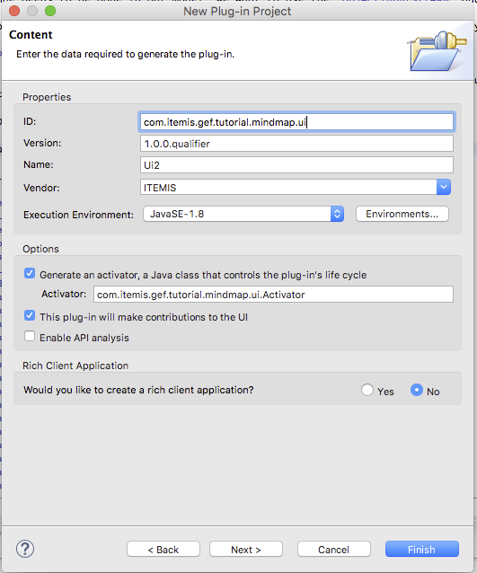
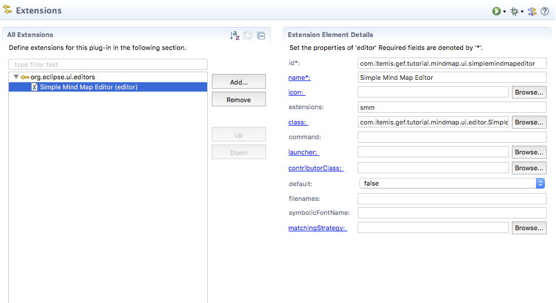

# Step 14 - Create an Eclipse Editor

In this Tutorial we want to integrate the GEF-Editor into the Eclipse IDE. basic knowledge about how to develop Eclipse Plug-ins are presumed.

## Modifying the existing projects

To run the editor plug-in, we need to export the following packages in `com.itemis.gef.tutorial.mindmap`:

 * com.itemis.gef.tutorial.mindmap
 * com.itemis.gef.tutorial.mindmap.models

Open the file *MANIFEST.MF*, and click on the tab *Runtime*. Add the two packages to the left list and store the file.

The second change needs to be done in out model. We want to use the `ObjectInputStream` and `ObjectoututStream` to store the mind map. This means, every object in our model needs to implement the `Serializable` interface. Sadly `Color`does not. Therefore we set the color property transient, meaning, we don't want to store it in the file. The editor sets the color to the default color, when the file is loading. Make sure you have the following line of code in `MindMapNode`:

	transient private Color color;
	
This is just a quick hack to be able to save with almost no effort. A real application should implement its own serializer or color class. However, this is out of the scope of this tutorial.

## Creating a plug-in project

We need to create a new plug-in project, named `com.itemis.gef.tutorial.mindmap.ui`. 
 
Fill out the second page of the editor as the following screenshot shows:

We need to generate an `Activator` which initializes the eclipse plug-in. 

After the creation, we need to add the dependencies to our project. The easiest way to do this, is by copying the following content in the manifest editors *MANIFEST.MF* tab. 

Of course, we'll need the other mindmap projects, as well as some GEF plug-ins. The imported packages starting with `com.google` are *Google Guice* packages which we also imported in the other mind map manifests. 
 
The other dependencies provide the API to open an editor and load/save its content.
 
## Implementing the Editor
 
The eclipse workbench consists of two main elements: *views* end *editors*. *Editors* are connected to a resource, in our case a file, which contains our data. We will give it the suffix *smm* (for Simple Mind Map). When we open a file e.g. via double click on the filename in the *Project Explorer* eclipse is looking for an editor in its registry. If one is found it will be opened.

First, let's see the code of our editor class:

The `SimpleMindMapEditor` is a subclass of the GEF-provided `AbstractFXEditor`. The base class has a constructor with one parameter: the google guice injector. 
We use the *Guice* to crate a new injector based on our module, but need some bindings, specific to the Eclipse UI. Luckily *Guice* provides a method, to overrride methods in our module with ones from the `MvcFxUiModule`.

By default the base class create an inifinite canvas to work with. But we also want our tooling palette. Similar to the application, we override `hookViewers` and add the buttons. We don't need the undo/redo buttons, because eclipse already delivers them. 

After the editor is created, `init`is called, giving us the input to edit. We try to open the file and read it via `ObjectInputStream`. If this fails, e.g. the file is empty (which happens, when you create a new file) we just create an empty mind map. Finally we fetch the `ContenModel`from the viewer and set the mind map as content.

When we change the model, the editors state is set to *dirty*. A dirty state is indicated by an asterisk in the name of the editor. When the save command is triggered, `save`is called and we store the mind map in the associated file using `ObjectOutputStream`. Finally we set the dirty state to false and propagate the state change, so eclipse can set the workbench accordingly.

With this minor additions we are able to use our mind map editor in an eclipse workbench.
 
## Using the editor
 
We implemented the editor, now we need to tell eclipse, to use it.

Open the file *plugin.xml* in the projects root. Every extension of the workbench is added to a predefined *extension points*.
In our case, we use the extension point `org.eclipse.ui.editors`. Go to the tab *Extensions*, click *Add...*, choose the  extension point and press finish.

The tree contains now a node called `org.eclipse.ui.editors`. Click on its child (labeled *name(editor)*) and fill out the appearing form as shown in the following screenshot:

 
In this form we specify:

* *id* to uniquely identify the editor in the workbench
* *name* used e.g. in the "Open With ..." menu
* *extension* this is the file extension, connected with the editor. we use `smm`
* *class* is the class we implemented in the former section. Eclipse will instantiate it only when it is s, meaning we are opening a smm file

We ignore the other attributes. 
 
The plugin.xml should have the following content:

## Running Eclipse

To test the editor, we need to create a run configuration. Choose *Run As->Run Configurations* in the context menu of the project.

Select *Eclipse Application* and choose *new* in the context menu. Go to the *Arguments* tab and add the following line to the VMArgs:

	-Dosgi.framework.extensions=org.eclipse.fx.osgi

In addition go to *Environment* and add a new variable. The name is *SWT_GTK3* and the value is *0*.

Press *Apply* to save the configuration or *Run* to save and execute it.

Alternatively you can use can create launch configuration a new text file named *SimpleMindMapPlugin.launch*. Copy and paste the following content:

After saving the file, you can choose *Run As->SimpleMindMapPlugin* and the a new eclipse instance with our editor plugin will start.

After the new eclipse is started, create a general project and in that a new file names *test.ssm*. Our editor will open and you can add nodes and connections.